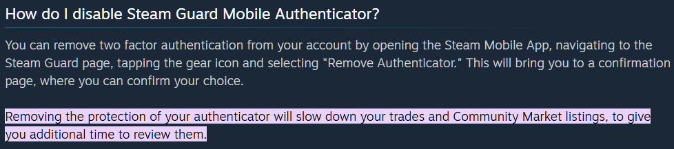
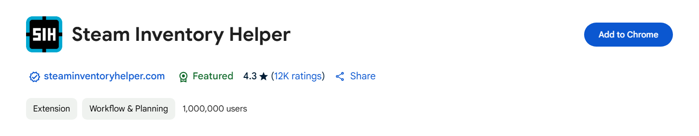
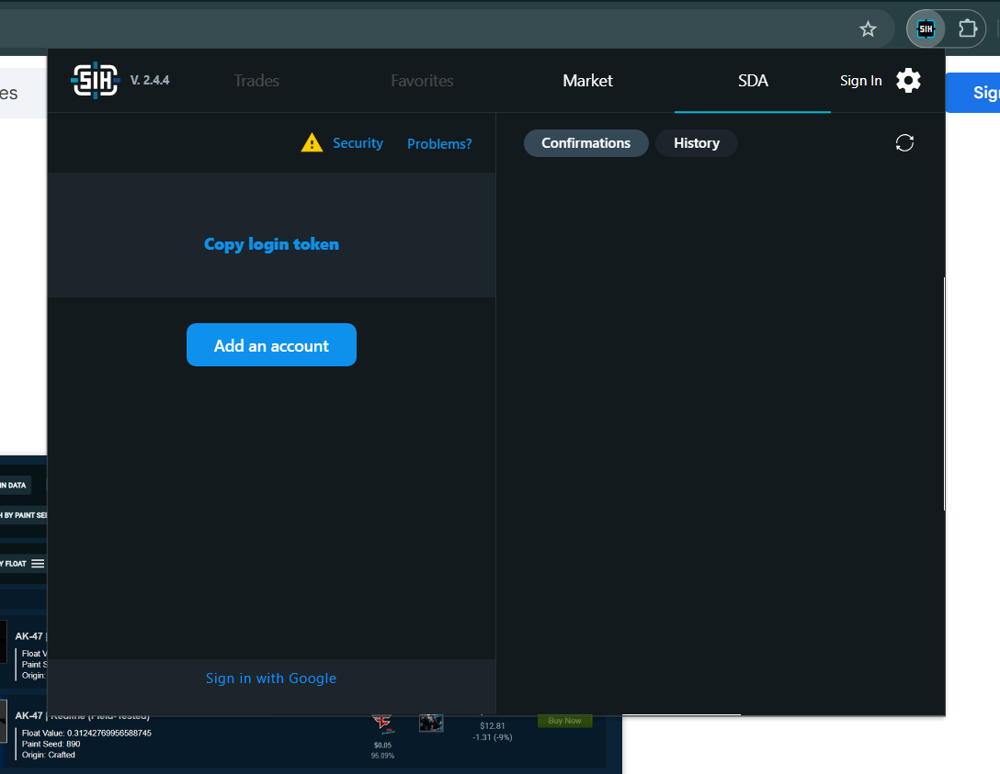
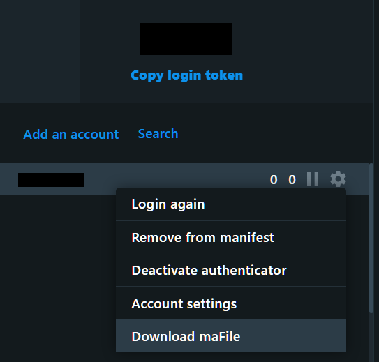

# Shared Secret
The **Steam Shared Secret** is a crucial security feature used in conjunction with **Steam Mobile Authenticator** to provide <ins>two-factor authentication (2FA)</ins> for your Steam account. It's a unique, alphanumeric code that is generated and stored securely on your mobile device when you enable the **Steam Mobile Authenticator**.

## What it is
* A unique, account-specific code
* Used to generate dynamic authentication codes every ~30 seconds

## What it's used for
The primary purpose of the Steam Shared Secret is to protect your Steam account from unauthorized access, adding an extra layer of security beyond just your username and password. Here's how it's used:
* Confirming new logins: When you (or anyone else) tries to log in to your Steam account from a new device or web browser, Steam will require not only your username and password but also the current 6-digit code generated by your Steam Mobile Authenticator. This code is derived from your Shared Secret, ensuring that only someone with access to your mobile device (and thus the Shared Secret) can approve the login.
* Confirming trades and market listings: For added security of your in-game items and Steam Wallet funds, the Shared Secret is also used to instantly confirm trades and market listings initiated from your account. Without the Mobile Authenticator (and therefore the Shared Secret), these actions are often subject to a holding period. See the image below:

* Account recovery: In some account recovery scenarios, having access to your Steam Mobile Authenticator (and implicitly the Shared Secret) can help expedite the process of regaining access to your account.

In essence, the Steam Shared Secret acts as a digital key that only your authorized Steam Mobile Authenticator can use to generate the time-sensitive codes required for critical account actions. This significantly reduces the risk of your account being compromised by phishing, keyloggers, or other malicious attempts to steal your login credentials.

Therefore, it's vital to keep your Steam Mobile Authenticator secure as it holds the key to accessing and protecting your Steam account. If you lose access to your authenticator without having a recovery code, the account recovery process can be more involved.

## How to get it

While various methods exist to retrieve your Steam Shared Secret, such as utilizing [Steam Desktop Authenticator](https://github.com/Jessecar96/SteamDesktopAuthenticator) or [steamguard-cli](https://github.com/dyc3/steamguard-cli), this guide will illustrate a user-friendly approach using the **Steam Inventory Helper** browser extension ([Steam Inventory Helper](https://chromewebstore.google.com/detail/steam-inventory-helper/cmeakgjggjdlcpncigglobpjbkabhmjl)). We will be using Google Chrome for this demonstration, given its widespread accessibility.

1.  Begin by visiting your browser's extension marketplace and installing **Steam Inventory Helper** by clicking the "Add to Chrome" button.

2.  After installation, open the Steam Inventory Helper extension. Navigate to the `SDA` (Steam Desktop Authenticator emulation) section and select "Add an Account." Follow the on-screen prompts to log in to your Steam account.

3.  Locate your newly added account username within the extension. Next to it, you'll observe the dynamically generated 6-digit authentication codes. Click the **Gear icon** associated with your account. From the options presented, find and click the button labeled **`Download maFile`**. This action will download a file containing your account's authentication details, including the Shared Secret.

4.  Open the downloaded `maFile` with any plain text editor (e.g., Notepad, TextEdit). Within the file's content, search for the entry with the key `"shared_secret"`. The corresponding value, enclosed in double quotes, is your Steam Shared Secret. **Carefully copy the entire content within these double quotes.**